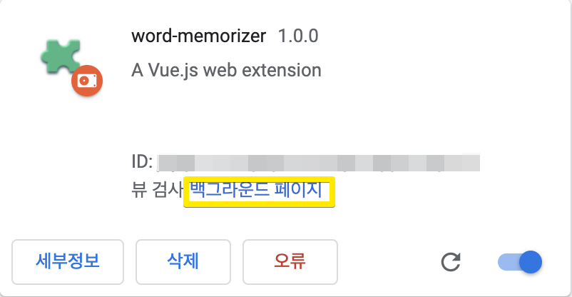

# Chrome Extension
크롬 브라우저 위에서 동작하는 프로그램


---
## 디버깅 방법
크롬에 프로그램을 올려서 디버깅 해야한다. 

### Background
크롬 브라우저에서 ``` chrome://extensions``` 로 접속하여 <br>
  <br>
확장 프로그램 카드 하단에 ``백그라운드 페이지`` 클릭

### Popup
크롬 브라우저에서 
``` chrome-extensions://{chrome-extension-id} ```
로 접속하여  개발자 모드로 디버깅 진행


### Content
확장프로그램이 동작하는 모든 일반 페이지에서 로그확인 가능

---
## 참고
- https://shiffman.net/a2z/chrome-ext/